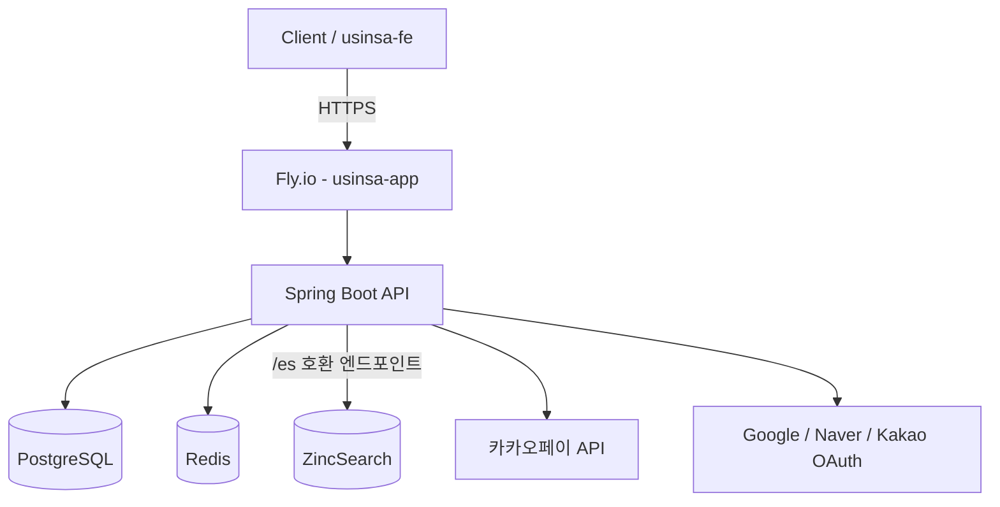
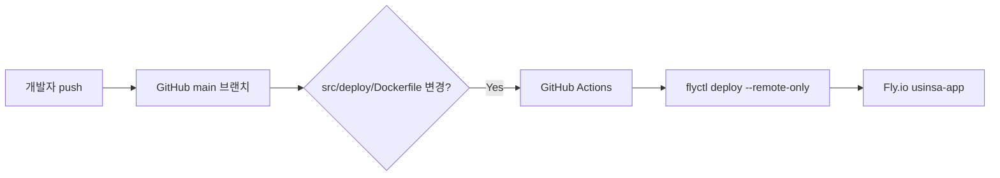
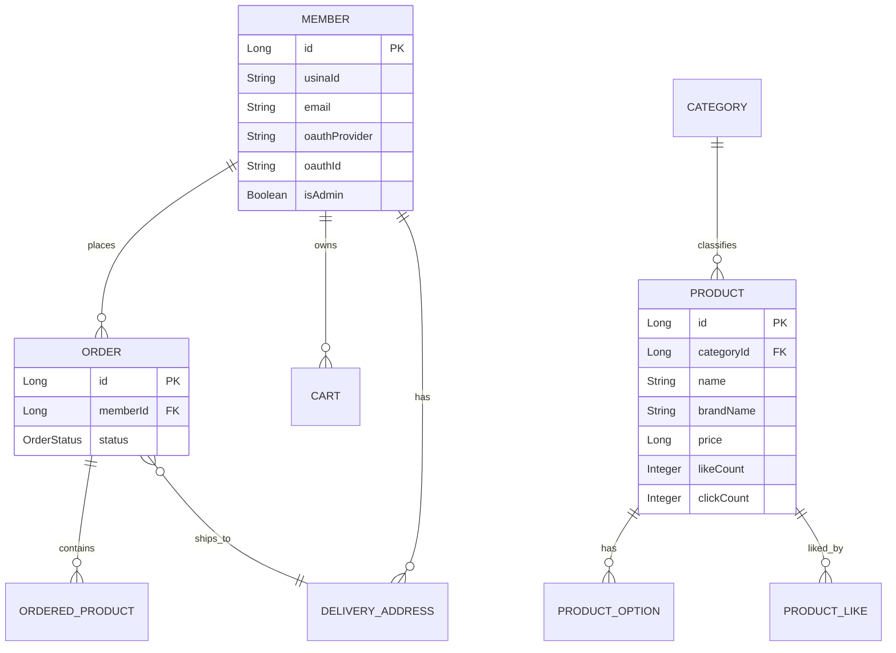

# USINSA

패션 커머스 백엔드 API 서버입니다. 회원가입부터 상품 검색, 장바구니, 주문, 카카오페이 결제까지 커머스 서비스의 전체 흐름을 직접 설계하고 배포까지 운영했습니다.

## 목차

- [프로젝트 소개](#프로젝트-소개)
- [기술 스택](#기술-스택)
- [시스템 아키텍처](#시스템-아키텍처)
- [인프라 구성](#인프라-구성)
- [CI/CD 파이프라인](#cicd-파이프라인)
- [디렉터리 구조](#디렉터리-구조)
- [데이터베이스 설계](#데이터베이스-설계)
- [주요 기술적 의사결정](#주요-기술적-의사결정)
- [트러블슈팅](#트러블슈팅)
- [보안](#보안)
- [회고](#회고)

---

## 프로젝트 소개

**한 줄 소개**: OAuth2 소셜 로그인, 검색 엔진 기반 상품 검색, 결제를 갖춘 패션 커머스 백엔드 API 서버

**개발 배경**:
패션 E커머스 서비스를 프론트엔드(`usinsa-fe`)와 함께 풀사이클로 구현하며, 단순 CRUD API가 아니라 실제 서비스 운영 시 마주치는 문제(비회원 장바구니 세션, 검색 정확도, 결제 보안, 캐시 정합성)를 직접 겪고 해결하는 것을 목표로 했습니다.

**해결하려고 한 문제**
- 로컬 개발 환경(Elasticsearch)과 실제 배포 환경(리소스 제약이 있는 ZincSearch)이 다른 상황에서, 두 검색 엔진을 하나의 인터페이스로 추상화하는 문제
- 비회원과 회원이 동시에 사용하는 장바구니의 세션/쿠키 처리 문제
- PG 결제 연동 시 타인의 주문을 결제하거나 TID를 탈취해 재사용하는 등의 보안 취약점
- 좋아요 수 같은 자주 조회되는 값의 DB 부하

**주요 목표**
- 포트/어댑터 패턴으로 검색 엔진 교체 가능한 구조 설계
- Redis를 이용한 캐싱, 세션 관리, 토큰 저장 등 다목적 활용
- JWT 기반 인증 + OAuth2 소셜 로그인(Google/Naver/Kakao) 구현
- GitHub Actions를 통한 자동 배포 파이프라인 구축

---

## 프로젝트 인원

- 개발 인원 : 2인
- 담당 역할 : 서비스 전체 (인증, 상품/검색, 장바구니, 주문/결제, 배포)

---

## 주요 기능

| 기능 | 설명 |
|---|---|
| 회원가입 / 로그인 | 자체 회원가입 + Google/Naver/Kakao OAuth2 소셜 로그인 |
| 인증 | JWT Access/Refresh Token 발급, 갱신, 블랙리스트 관리(Redis) |
| 상품 검색 | ZincSearch(운영) / Elasticsearch(로컬) 기반 상품명·브랜드·카테고리 통합 검색, 한글 형태소 분석(cjk analyzer) |
| 검색 이력/트렌드 | 회원별 검색 이력 저장, 인기 검색어 집계 |
| 장바구니 | 회원/비회원(세션 기반) 장바구니, 로그인 시 병합 |
| 상품 좋아요 | Redis Cache-Aside 패턴으로 좋아요 수·여부 캐싱 |
| 주문 | 주문 생성, 상태 관리(생성→결제대기→결제완료→취소) |
| 결제 | 카카오페이 단건 결제(준비/승인/취소), Redis 기반 TID 관리 |
| 배송지 관리 | 회원별 배송지 등록/조회/수정/삭제 |
| API 문서 | Swagger(springdoc-openapi) 기반 자동 문서화 |

---

## 기술 스택

### Backend
- **Java 21 / Spring Boot 3.2.5** — 최신 LTS 기반으로 가상 스레드 등 최신 기능 활용 가능
- **Spring Data JPA** — 엔티티 중심 도메인 설계
- **Spring Security + OAuth2 Client** — 자체 인증과 소셜 로그인을 하나의 필터 체인에서 관리
- **JJWT 0.11.5** — Access/Refresh Token 발급 및 검증
- **Spring WebFlux(WebClient)** — 카카오페이 등 외부 API 비동기 호출
- **Spring Data Elasticsearch** — 로컬 개발 환경 검색

### Database
- **PostgreSQL** — 운영 DB
- **H2** — 로컬 개발용 인메모리 DB
- **Redis 7.2** — 좋아요 캐시, Refresh Token/블랙리스트 저장, 카카오페이 TID 저장, 비회원 세션 보조 저장소로 다목적 활용

### Search
- **Elasticsearch 8.15** — 로컬 개발 환경
- **ZincSearch** — 운영 환경 (경량 리소스로 동작하는 Elasticsearch 호환 검색 엔진)

### Infra / DevOps
- **Docker (멀티스테이지 빌드)** — 빌드용 JDK 이미지와 실행용 JRE 이미지 분리로 이미지 경량화
- **Fly.io** — 컨테이너 배포 플랫폼 (`fly.toml`로 리전, 리소스, 헬스체크 설정)
- **GitHub Actions** — `main` 브랜치 push 시 자동 배포(`flyctl deploy`)
- **docker-compose** — 로컬 개발용 PostgreSQL / Elasticsearch / Redis 통합 실행

각 기술 선택 이유는 [주요 기술적 의사결정](#주요-기술적-의사결정) 섹션에 정리했습니다.

---

## 시스템 아키텍처



로컬 개발 환경에서는 ZincSearch 대신 `docker-compose`로 띄운 Elasticsearch를 사용하며, `ProductSearchPort` / `ProductIndexPort` 인터페이스를 통해 두 구현체가 Spring Profile(`dev` / `prod`)에 따라 자동으로 교체됩니다.

---

## 인프라 구성

현재는 AWS EC2/VPC 대신 **Fly.io** 기반 단중 컨테이너 배포를 사용하고 있습니다.

- **빌드**: `Dockerfile`이 멀티스테이지로 구성되어 `eclipse-temurin:21-jdk-alpine`에서 `./gradlew bootJar`로 빌드 후, `eclipse-temurin:21-jre-alpine` 런타임 이미지에 결과물만 복사
- **런타임 리소스 제어**: `-XX:MaxRAMPercentage=75.0` 등 JVM 옵션으로 컨테이너 메모리 제한(512MB) 내에서 안정적으로 동작하도록 튜닝
- **HTTP 서비스 설정**(`fly.toml`): 리전 `nrt`(도쿄), `force_https`, 최소 1대 상시 기동(`min_machines_running = 1`), 동시 연결 수 제한(soft 20 / hard 25)
- **환경 변수/시크릿**: DB 접속 정보, JWT Secret, 카카오페이 키, OAuth 클라이언트 시크릿, ZincSearch 인증 정보 등은 모두 환경 변수로 주입(`application-prod.yml`에서 `${...}` 참조)
- **쿠키 보안**: 운영 환경에서 `server.cookie.secure=true`, 도메인 `.usinsa.store`로 제한

---

## CI/CD 파이프라인



- **브랜치 전략**: `main` 브랜치에 `src/**`, `deploy/**`, `fly.toml`, `Dockerfile`, 워크플로우 파일 변경이 있을 때만 배포 트리거 (문서 수정 등으로 인한 불필요한 배포 방지)
- **빌드 과정**: GitHub Actions 러너에서 `flyctl`을 통해 원격 빌드(`--remote-only`)로 위임, 로컬/러너에 Docker 빌드 환경을 직접 구성할 필요 없음
- **캐시 정책**: `--no-cache` 옵션으로 매 배포마다 클린 빌드 (배포 안정성 우선, 빌드 속도는 트레이드오프)
- **시크릿 관리**: `FLY_API_TOKEN`을 GitHub Secrets로 관리
- **무중단 배포**: Fly.io의 기본 롤링 배포 방식을 사용 (`min_machines_running = 1`로 배포 중에도 최소 1대는 항상 응답 가능)
- **롤백**: Fly.io 플랫폼의 릴리스 히스토리를 통해 이전 버전으로 롤백 가능

---

## 디렉터리 구조

```text
usinsa-be
 ├── src/main/java/com/usinsa/backend
 │    ├── domain
 │    │    ├── auth          # 인증 (JWT, OAuth2)
 │    │    ├── member        # 회원
 │    │    ├── product       # 상품, 좋아요 캐시
 │    │    ├── category      # 카테고리
 │    │    ├── search        # 검색 (어댑터 패턴: Elasticsearch/ZincSearch)
 │    │    ├── cart          # 장바구니
 │    │    ├── order         # 주문
 │    │    ├── payment       # 카카오페이 결제
 │    │    ├── delivery      # 배송
 │    │    └── deliveryAddress
 │    ├── global
 │    │    ├── config        # Security, CORS, Swagger 설정
 │    │    ├── filter        # JWT 인증 필터
 │    │    ├── security      # 인증 예외 핸들러
 │    │    ├── exception      # 커스텀 예외/에러코드
 │    │    └── util
 │    └── UsinsaApplication.java
 ├── src/main/resources
 │    ├── application.yml
 │    ├── application-dev.yml
 │    ├── application-prod.yml
 │    └── application-secret.yml   # (gitignore, 커밋되지 않음)
 ├── docs                     # 트러블슈팅/설계 문서
 ├── deploy                   # 배포 보조 스크립트
 ├── docker-compose.yml       # 로컬 개발용 Postgres/ES/Redis
 ├── Dockerfile
 ├── fly.toml
 └── .github/workflows/deploy.yml
```

---

## 데이터베이스 설계



- **Member**: 자체 회원 + OAuth 회원을 하나의 테이블에서 관리(`oauthProvider`, `oauthId`로 구분), `Order`/`Cart`/`DeliveryAddress`와 1:N 관계
- **Product**: 카테고리와 N:1, 옵션(`ProductOption`)과 1:N. 좋아요/클릭 수는 엔티티 컬럼으로도 유지하되 조회 시 Redis 캐시를 우선 사용
- **Order**: `OrderStatus` enum(`CREATED → PAYMENT_READY → PAYMENT_COMPLETED / CANCELLED`)으로 결제 상태 흐름 관리

---

## 주요 기술적 의사결정

### 왜 검색 엔진을 포트/어댑터 패턴으로 분리했는가?
- **문제**: 로컬에서는 Elasticsearch를 쓰지만, 운영 서버(Fly.io 512MB 인스턴스)에서는 리소스가 무거운 Elasticsearch 대신 경량 ZincSearch를 써야 했습니다.
- **고려한 방법**: ① 운영/로컬 모두 Elasticsearch로 통일, ② 검색 로직에 if-else로 엔진 분기, ③ 인터페이스로 추상화 후 Profile별 구현체 주입
- **선택한 이유**: ①은 운영 서버 리소스 초과 위험, ②는 도메인 코드가 특정 검색 엔진 구현에 종속되어 테스트와 유지보수가 어려움. `ProductSearchPort`/`ProductIndexPort` 인터페이스를 정의하고 `@Profile("dev"/"prod")`로 구현체를 나눠, 상위 서비스 코드는 어떤 검색 엔진을 쓰는지 몰라도 되도록 했습니다.
- **결과**: 검색 엔진 교체가 설정 변경만으로 가능해졌고, 실제로 운영에서 ZincSearch의 Native API와 ES 호환 API(`/es/`) 차이로 검색이 깨졌을 때도 어댑터 한 곳만 수정해서 해결했습니다. (자세한 내용은 트러블슈팅 참고)

### 왜 Redis를 여러 용도로 도입했는가?
- **문제**: 좋아요 수 조회마다 COUNT 쿼리가 발생해 상품 목록 조회가 느렸고, Refresh Token/카카오페이 TID처럼 TTL이 필요한 데이터를 RDB에 두면 만료 처리가 번거로웠습니다.
- **고려한 방법**: 로컬 캐시(Caffeine) vs Redis
- **선택한 이유**: 단일 인스턴스가 아니라 추후 스케일아웃을 고려했고, TTL 기반 자동 만료(Refresh Token, TID, 좋아요 캐시)가 필요해 Redis를 선택
- **결과**: Cache-Aside 패턴으로 좋아요 조회 응답 시간을 수십 ms에서 수 ms 수준으로 단축(자세한 수치는 [성능 개선](#성능-개선) 참고), Redis 장애 시 DB 폴백 로직을 함께 구현해 가용성 확보

### 왜 Docker 멀티스테이지 빌드를 사용했는가?
- **문제**: JDK 전체를 포함한 이미지를 그대로 배포하면 이미지 용량이 크고, 512MB 메모리 제한이 있는 Fly.io 인스턴스에서 불필요한 리소스를 낭비
- **선택한 이유**: 빌드는 `jdk-alpine`에서, 실행은 `jre-alpine` + 산출물 `jar`만 복사하는 구조로 최종 이미지를 경량화
- **결과**: 런타임 이미지에 불필요한 빌드 도구가 포함되지 않아 이미지 크기와 공격 표면을 동시에 줄임

### 왜 Fly.io를 선택했는가?
- AWS EC2 + Nginx + HAProxy 구성 대신, 신입 개발자가 혼자 운영 가능한 범위에서 HTTPS·헬스체크·오토스케일 기본값을 제공하는 Fly.io를 선택했습니다. `fly.toml` 설정만으로 리전, 리소스, 동시성 제한을 코드로 관리(Infra as Code)할 수 있다는 점도 고려했습니다.

---

## 트러블슈팅

### 1. 운영 환경에서 검색이 키워드와 무관하게 아무 상품이나 반환됨

**문제**
운영(ZincSearch) 환경에서 검색어를 입력하면 관련 없는 상품들이 무작위로 반환되는 현상 발생. 로컬(Elasticsearch)에서는 정상 동작.

**원인 분석**
ZincSearch는 자체 Native API(`/api/{index}/_search`)와 Elasticsearch DSL 호환 API(`/es/{index}/_search`)를 별도로 제공하는데, 검색 어댑터가 Native API 엔드포인트로 ES DSL 쿼리(`multi_match` 등)를 보내고 있었습니다. Native API는 이 쿼리 형식을 제대로 해석하지 못해 사실상 전체 문서를 반환하는 방식으로 동작했습니다.

**해결 과정**
1. ZincSearch 공식 문서를 확인해 Native API와 ES 호환 API의 엔드포인트 차이(`/api/` vs `/es/`)를 확인
2. `ZincSearchClient.search()`의 요청 URL을 `/es/{index}/_search`로 변경
3. 검색 범위를 `name` 단일 필드에서 `multi_match`로 `name`, `brandName`, `categoryName` 세 필드로 확장
4. 빈 검색어로 인한 전체 결과 반환을 막기 위해 `zero_terms_query: none` 옵션 추가
5. 한글 검색 정확도를 위해 인덱스 매핑에 `cjk` analyzer 적용

**결과**
검색어에 맞는 상품만 정확히 반환되도록 수정되었고, 브랜드명/카테고리명으로도 검색이 가능해졌습니다. analyzer 변경은 기존 인덱스에 소급 적용되지 않기 때문에, 배포 후 인덱스를 재생성하고 전체 상품을 재색인하는 과정이 필요했습니다.

**배운 점**
"Elasticsearch 호환"이라는 표현을 그대로 믿지 않고, 실제 API 스펙 문서를 직접 확인하는 습관의 중요성을 배웠습니다. 또한 로컬과 운영 환경의 인프라가 다를 때는 통합 테스트만으로는 잡히지 않는 문제가 있을 수 있다는 점도 확인했습니다.

---

### 2. 비회원 장바구니에 담은 상품이 페이지 이동 시 사라짐

**문제**
비로그인 상태에서 장바구니에 상품을 추가하면 백엔드는 정상 처리되지만, 장바구니 페이지로 이동하면 목록이 비어 있음. 로그인 상태에서는 정상 동작.

**원인 분석**
두 가지 원인이 겹쳐 있었습니다.
- 백엔드: Spring Security 세션 정책이 `STATELESS`로 설정되어 있어 세션 자체가 생성되지 않음
- 프론트엔드: axios 클라이언트에 `withCredentials`가 설정되지 않아 쿠키가 요청에 포함되지 않음

**해결 과정**
1. `SecurityConfig`의 세션 정책을 `STATELESS`에서 `IF_REQUIRED`(이후 `X-Session-Id` 헤더 기반 방식으로 재개선)로 변경
2. `CorsConfig`에서 `Set-Cookie` 헤더를 `exposedHeaders`에 추가해 브라우저가 응답 쿠키를 저장할 수 있도록 수정
3. 프론트엔드 axios 인스턴스에 `withCredentials: true` 추가
4. 비회원 장바구니 → 로그인 시 회원 장바구니로 병합되는 로직 검증

**결과**
비회원도 새로고침 후에도 장바구니가 유지되고, 로그인 시 기존 항목과 병합되는 것을 확인했습니다.

**배운 점**
JWT는 Stateless가 기본이지만, 세션이 필요한 기능(비회원 장바구니)이 공존할 경우 인증 방식과 세션 정책을 기능 단위로 분리해서 설계해야 한다는 것을 배웠습니다. 이후 세션 쿠키 대신 명시적인 `X-Session-Id` 헤더 방식으로 한 단계 더 개선했습니다.

---

### 3. 결제 API의 주문 소유권 검증 누락 위험

**문제**
개발 초기 `SecurityConfig`에 `/api/**`를 전체 허용(permitAll)해 둔 상태로 결제 API를 테스트하다가, 인증 없이도 임의의 `orderId`로 결제 준비/승인 API를 호출할 수 있다는 잠재적 위험을 발견했습니다.

**원인 분석**
컨트롤러 레벨에서 `Authentication` 객체로 사용자를 식별하고는 있었지만, 서비스 레벨에서 "요청자가 실제로 그 주문의 소유자인지"를 검증하는 로직이 없어 다른 사용자의 `orderId`를 넣으면 결제가 진행될 수 있는 구조였습니다.

**해결 과정**
1. `PaymentService`에 `validateOrderOwnership(order, memberId)` 메서드를 추가해 주문의 `member.id`와 요청자 `memberId`를 비교
2. 준비/승인/취소 세 API 모두에 소유권 검증 로직 적용
3. `SecurityConfig`에서 인증이 필요한 API 범위를 명시적으로 재정의(`permitAll` 대상을 로그인/공개 조회 API로 최소화)
4. 카카오페이 TID를 Redis에 `orderId`와 1:1로 매핑해 저장, 타인의 TID를 다른 주문에 재사용할 수 없도록 차단

**결과**
네트워크 계층(SecurityConfig) → 인증 계층(JWT 필터) → 비즈니스 로직(소유권 검증) → 데이터 계층(TID-주문 매핑)까지 다층 방어 구조를 갖추게 되었습니다.

**배운 점**
인증(Authentication)과 인가(Authorization)는 다른 문제라는 것을 실제 취약점을 발견하며 체감했습니다. "로그인한 사용자인가"뿐 아니라 "이 리소스에 접근할 권한이 있는 사용자인가"를 항상 별도로 검증해야 한다는 원칙을 세웠습니다.

---

### 4. 상품 좋아요 기능의 DB 부하

**문제**
상품 목록에 좋아요 수를 함께 노출하면서, 목록 조회 시마다 좋아요 개수 COUNT 쿼리와 로그인 사용자의 좋아요 여부 EXISTS 쿼리가 반복 실행되어 응답이 느려짐(100개 상품 기준 5~10초).

**원인 분석**
매 요청마다 RDB에 집계 쿼리를 던지는 구조였고, 좋아요는 읽기 비중이 압도적으로 높은 데이터라 캐시를 적용하기 좋은 후보였습니다. 다만 캐시와 DB 간 정합성이 깨지면 좋아요 수가 실제와 달라지는 문제가 있어 신중한 전략이 필요했습니다.

**해결 과정**
1. Cache-Aside 패턴 설계: 조회는 캐시 우선, 쓰기는 DB 저장 후 캐시 갱신(Write-Through)
2. Redis 키 구조를 `product:like:count:{productId}`, `product:like:member:{memberId}`, `product:like:likers:{productId}`로 분리 설계
3. 좋아요 추가/취소는 Redis의 원자적 연산(`INCR`/`DECR`, `SADD`/`SREM`)으로 처리해 동시성 문제 방지
4. Redis 장애 시 DB로 폴백하는 예외 처리 추가
5. 관리자용 캐시 무효화/워밍업 API 별도 구현

**결과**
좋아요 개수 조회가 50~100ms에서 1~5ms 수준으로, 100개 상품 목록 조회가 5~10초에서 0.5~1초 수준으로 개선되었습니다(측정 환경 기준 추정치).

**배운 점**
캐시는 "빠르게 만드는 도구"이기 이전에 "정합성을 어떻게 깨뜨리지 않을지"를 먼저 설계해야 하는 도구라는 것을 배웠습니다. 특히 원자적 연산과 장애 폴백을 함께 고려하지 않으면 오히려 버그의 원인이 될 수 있다는 점을 실감했습니다.

---

## 성능 개선

| 작업 | 개선 전 | 개선 방법 | 개선 후 |
|---|---|---|---|
| 좋아요 개수 조회 | 50~100ms (DB COUNT) | Redis Cache-Aside | 1~5ms |
| 좋아요 중복 체크 | 20~50ms (DB EXISTS) | Redis SET 조회 | 1~3ms |
| 상품 목록 조회(100개) | 5~10s | 캐시 적용 | 0.5~1s |
| 검색 정확도 | 검색어 무관 전체 반환 | ES 호환 엔드포인트 + multi_match + cjk analyzer | 키워드 기반 정확한 결과 |

---

## 보안

- **JWT**: Access/Refresh Token 분리 발급, 각 토큰에 `jti`(고유 ID) 부여로 개별 토큰 무효화(블랙리스트) 가능
- **Refresh Token 관리**: Redis에 `memberId`, `deviceId`와 함께 저장해 디바이스 단위 로그아웃 지원
- **OAuth2**: Google/Naver/Kakao 소셜 로그인, Authorization Request를 쿠키 기반 Repository에 저장해 Stateless 환경에서도 OAuth 플로우 유지
- **CORS**: 허용 Origin을 명시적으로 화이트리스트 관리(`localhost:5173`, 운영 도메인 등), `Set-Cookie` 등 필요한 헤더만 노출
- **인가(Authorization)**: 결제 API 등 민감 API는 컨트롤러의 인증 확인과 별개로 서비스 레벨에서 리소스 소유권을 검증(다층 방어)
- **비밀번호/시크릿 관리**: `application-secret.yml`을 `.gitignore`에 포함해 저장소에 커밋되지 않도록 분리, 운영 환경 시크릿은 모두 환경 변수로 주입
- **쿠키 보안**: 운영 환경에서 `Secure` 속성 및 도메인 범위 제한

---

## 회고

**가장 어려웠던 점**
로컬(Elasticsearch)과 운영(ZincSearch) 환경이 다르다는 사실 자체는 알고 있었지만, "ES 호환"이라는 표현만 믿고 API 스펙 차이를 검증하지 않아 운영에서만 재현되는 버그를 겪었습니다. 로그만으로는 원인이 바로 드러나지 않아 공식 문서를 하나씩 대조하며 원인을 좁혀가야 했습니다.

**가장 많이 성장한 부분**
인증과 인가를 분리해서 생각하는 습관, 그리고 캐시를 도입할 때 성능보다 정합성을 먼저 설계하는 순서를 체득한 것이 가장 큰 성장이었습니다. 또한 포트/어댑터 패턴을 실제 문제(검색 엔진 이원화) 해결에 적용해보면서, 설계 패턴이 왜 필요한지를 몸으로 이해하게 되었습니다.

**다음에 개선하고 싶은 점**
- 트러블슈팅 과정에서 얻은 성능 수치를 실제 운영 트래픽 기준으로 재측정하고 모니터링 지표화
- 현재 단일 인스턴스로 운영 중인 배포 구조에 헬스체크 기반 알림 체계 추가
- 통합 테스트를 늘려 로컬/운영 환경 차이로 인한 회귀를 배포 전에 잡아낼 수 있도록 보완

**프로젝트를 통해 얻은 것**
기능을 동작시키는 것과, 그 기능이 왜 그렇게 설계되어야 하는지를 설명할 수 있는 것은 다른 수준의 이해라는 것을 배웠습니다. 이 프로젝트의 트러블슈팅 경험들은 모두 실제로 겪고 직접 원인을 추적해 해결한 것들입니다.

---

## 실행 방법

```bash
# 로컬 인프라 실행 (PostgreSQL, Elasticsearch, Redis)
docker-compose up -d

# 애플리케이션 실행 (dev 프로파일)
./gradlew bootRun
```

- API 문서: `http://localhost:8080/swagger-ui/index.html`

> `application-secret.yml`은 저장소에 포함되어 있지 않습니다. OAuth 클라이언트 ID/Secret, JWT Secret 등을 직접 채워 넣어야 로컬 실행이 가능합니다.
